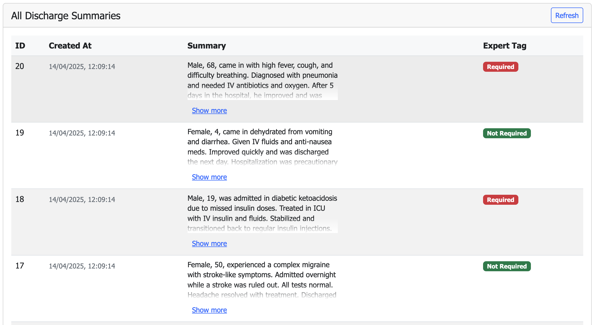
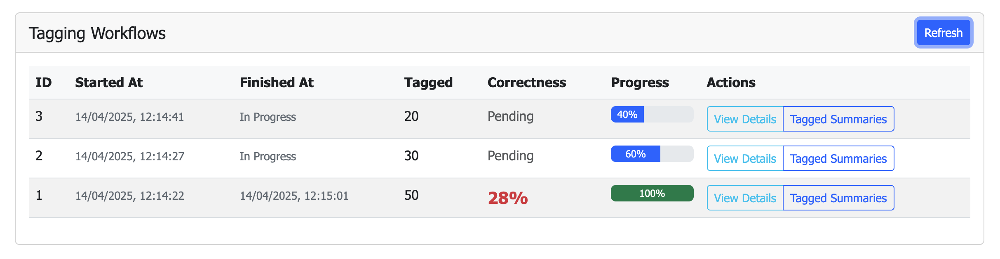
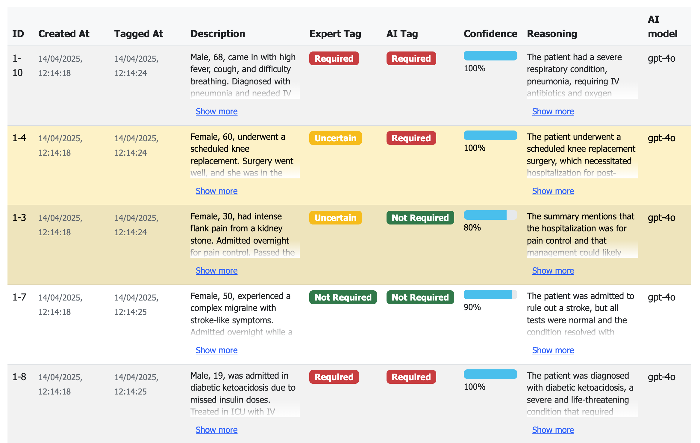

# Medical Discharge Summary Tagging System

## Problem Statement

Scientific research at medical universities often involves processing large volumes of unstructured data—a task that 
is both time-consuming and largely manual, typically performed by students or researchers. A prime example of such 
data is **medical discharge summaries**. These documents detail a patient’s condition, treatment, and post-discharge 
care. They are typically lengthy and packed with important information that requires analysis. There is no common 
template, each physician has their own style, and the summaries can vary significantly in length and content. 

## Experiment Overview

This experiment investigates whether an **AI Agentic System** can automatically tag medical discharge summaries based on the necessity of hospitalization. The system leverages **LLMs** (Large Language Models) to process summaries and assign tags, while also enabling human verification and comparative analysis.

The approach involves importing a dataset of summaries already tagged by human experts into the system. These same summaries are then processed by the AI, allowing researchers to compare AI-generated tags with expert assessments. The system tracks each tagging agent and provides statistics on how well the AI aligns with expert judgments. Researchers can iterate on the tagging process—modifying prompts and LLM configurations—until satisfactory results are achieved or the AI proves insufficient for the task.

Once the optimal configuration (prompt and LLM model) is identified, the system can autonomously tag new summaries without requiring expert input.

## Core Functionality

### Tagging Process

The application processes hospital discharge summaries and assigns one of the following tags:

- **HOSPITALIZATION_REQUIRED**: Hospitalization was clearly necessary.
- **HOSPITALIZATION_NOT_REQUIRED**: Hospitalization was clearly unnecessary.
- **UNCERTAIN**: Unclear whether hospitalization was necessary.
- **ERROR**: An issue with the summary or inability to assess necessity.

### Key Features

- **AI-Powered Analysis**: Automatically analyzes and tags summaries.
- **Confidence Scoring**: Provides confidence levels for each tag.
- **Expert Verification**: Allows experts to review and validate tags.
- **Comparative Analysis**: Compares AI results with expert decisions.
- **Progress Tracking**: Tracks workflow progress and completion.
- **Correctness Evaluation**: Measures AI alignment with expert tagging.

## Data Flow

1. **Data Import**  
   Discharge summaries are imported into the system as Akka Key Value Entities.  
   

2. **Tagging Initiation**  
   Users start tagging agents using configurable prompts (via Akka Workflow). Multiple agents can process data concurrently.  
   

3. **AI Tagging**  
   The AI processes each summary and assigns a tag with a confidence score.

4. **Storage and Review**  
   Tagged summaries are saved and made available for expert review.

5. **Comparison**  
   Experts compare their own tags with those assigned by the AI.  
   

6. **Statistics Collection**  
   System tracks accuracy and agreement between AI and expert tagging.

## Getting Started

### Prerequisites

- Java 21 installed
- Apache Maven
- Docker (for deployment)

### Building the Project

Use Maven to build the project:

```shell
mvn compile
```

### Running Locally

Export the necessary environment variables for the Akka service:

```shell
export OPENAI_API_KEY = "your_openai_api_key"
```

Or change the `application.conf` file to use a different model provider.

To start the service locally, run:

```shell
mvn compile exec:java
```

The service will be available at `http://localhost:9000`.

### SCSS and Styling

The project uses SCSS for styling with Bootstrap 5 dark theme. The SCSS files are located in `src/main/resources/scss/` and compiled to CSS in `src/main/resources/static-resources/`.

#### Available Commands

To compile SCSS to CSS once:

```shell
npm run build-css
```

To watch SCSS files for changes and automatically compile:

```shell
npm run watch-css
```

#### Bootstrap Dark Theme Configuration

The project uses Bootstrap dark theme which requires:

1. HTML files with `data-bs-theme="dark"` attribute on the html tag
2. SCSS configuration with:
   - `$theme: "dark"` variable
   - Using `@import` instead of `@use` for Bootstrap
   - Dark theme variables (e.g., `$body-bg: #000000`)

After making changes to SCSS files:
1. Compile with `npm run build-css`
2. Rebuild the application with `mvn clean compile`

#### Serving Static Resources

Static resources like CSS files must be explicitly mapped in the `StaticResourceEndpoint.java` class for the Akka framework to properly serve these files.

### Launch the tagging agent

Go to http://localhost:9000 and click on the "Start Tagging Process".

### API Usage

The application exposes several RESTful endpoints:

#### Tagging Workflows

- `GET /taggings`: List all tagging agents
- `GET /taggings/{id}`: Get a specific tagging agent
- `POST /taggings`: Start a new tagging agent
- `GET /taggings/last-prompt`: Get the prompt from the most recent tagging

#### Tagged Discharge Summaries

- `GET /tagged-summaries/{taggingId}`: Get all tagged summaries for a specific agent
- `GET /tagged-summaries`: Get all tagged summaries

### Web Interface

The web interface provides several views:

1. **Main Dashboard**: Lists all tagging workflows with progress information
2. **Tagging Details**: Shows detailed information about a specific tagging workflow
3. **Tagged Summaries**: Displays all discharge summaries processed in a workflow with their tags

## Testing

Run the test suite using Maven:

```shell
mvn test
```

To run a specific test:

```shell
mvn test -Dtest=IntegrationTest
```

## Deployment

Build a container image:

```shell
mvn clean install -DskipTests
```

Install the `akka` CLI as documented in [Install Akka CLI](https://doc.akka.io/reference/cli/index.html).

Deploy the service:

```shell
akka service deploy medi-tag medi-tag:tag-name --push
```

Refer to [Deploy and manage services](https://doc.akka.io/operations/services/deploy-service.html) for more information.

## Documentation

For more information about the underlying Akka platform, see:
- [Development Process](https://doc.akka.io/concepts/development-process.html)
- [Developing services](https://doc.akka.io/java/index.html)
- [Examples](https://doc.akka.io/java/samples.html)
